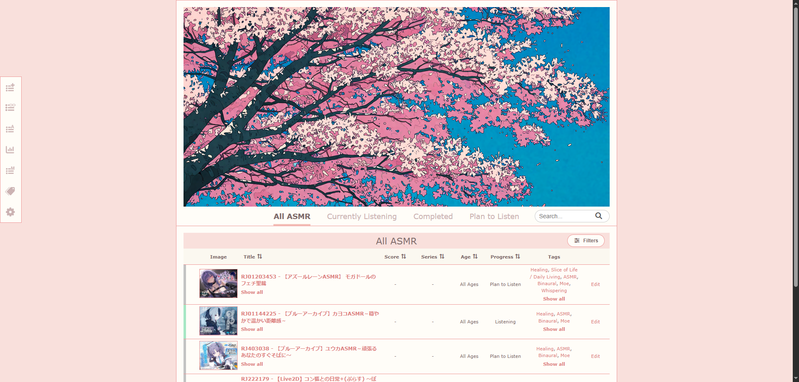
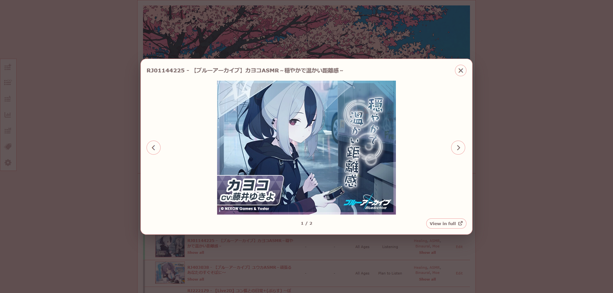
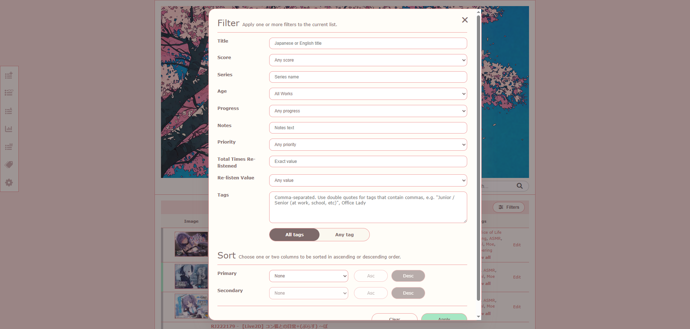
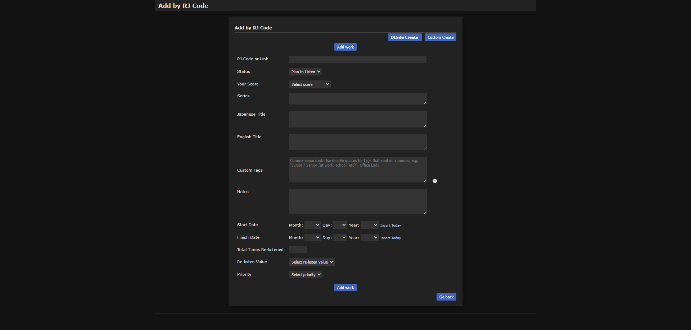
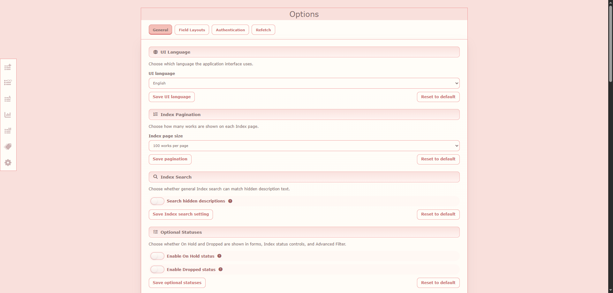
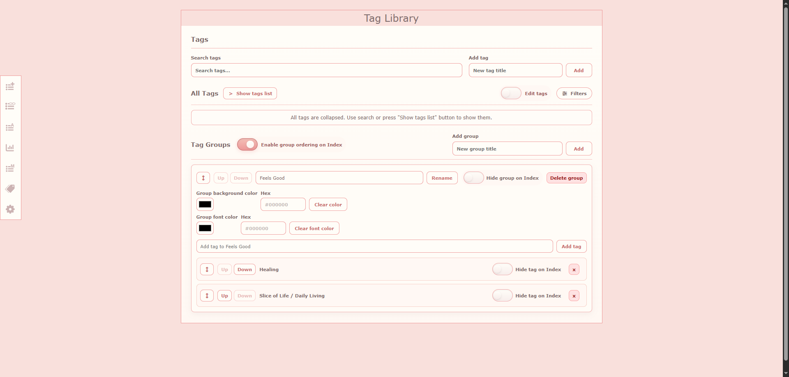

<h2 align="center">DLSite List</h2>

DLSite List is a single-user, self-hosted personal DLsite library for organizing your collection, inspired by [MyAnimeList](https://myanimelist.net)'s "Cherry Blossom" theme.

It supports DLsite works that have an RJ code - Games, Manga, Music, etc.

## Features

### ☰ Library Management

- **Add works:** Fetch metadata from DLsite, import multiple DLsite works at once, or create custom entries with your own details and images.
- **Edit works:** Edit work information and add details like current status, score, start and finish dates, priorities, and re-listens.
- **Tag Library:** Add your own tags and organize them into groups. Add parent/child relationships, customize tag and group colors, control visibility, and change their order on the Index.
- **Search and Filter:** Search, filter, and sort your library.
- **Image Viewer:** View saved covers and sample images.

### ⇄ Updates & Transfers

- **Refetch:** Check DLsite for updated metadata, covers, and sample images, and review changes before applying them.
- **Import and Export:** Export and Import your entire library or only selected Works, Images, Tag Library data, and Options using multipart ZIP files. Review imported changes before applying them.

### ⚙ Customization & Settings

- **Display options:** Customize pagination, search behavior, table width, columns, and how Notes and Tags are displayed.
- **Field layouts:** Configure field visibility and order for filters, sort menus, add and edit forms.
- **UI Wording**: Choose general or content-focused UI wording for listening, reading, games, video, music, and artwork.
- **Authentication:** Optional single-user authentication.
- **Languages:** English and Japanese UI with separate fetched tags for each language. The Japanese UI is mostly auto-translated, so quality may vary.

## Screenshots

### Index

<p align="center">
  <a href="docs/screenshots/index_1.png"></a>
  <a href="docs/screenshots/index_2.png"></a>
  <a href="docs/screenshots/index_3.png"></a>
</p>

### Quick Add, Options, Tag Library

<p align="center">
  <a href="docs/screenshots/quick_add_1.png"></a>
  <a href="docs/screenshots/options_1.png"></a>
  <a href="docs/screenshots/tag-library_1.png" target="_blank"></a>
</p>

## Quick Start (requires [Git](https://git-scm.com) and [Docker Compose](https://docs.docker.com/compose))

### 1) Run these commands

```bash
git clone https://github.com/Arednel/DLSite-List.git

cd DLSite-List

docker compose --env-file docker/.env.docker up --build -d
```

### 2) After startup
- DLSite List available at: `http://localhost:8080`
- Optional phpMyAdmin: http://localhost:8888 after enabling it in compose.yaml (disabled by default).
- Authentication is disabled by default. To add username and password, open `Options -> Authentication` and turn on `Require administrator login`.

## Manual installation process

### Requirements
- PHP 8.3
- Composer
- MySQL 8
- [Python 3.14.6](https://www.python.org/downloads/release/python-3146) (tested with this version) and [pip](https://pypi.org/project/pip)

### 1) Create `.env` from `.env.example` then run from the project root:

```bash
composer install
php artisan key:generate
php artisan migrate
php artisan storage:link
```

### 2) Create and activate the venv:
```bash
python -m venv python/venv
```

Activate it with:
- Windows: `python\venv\Scripts\activate`
- Linux/macOS: `source python/venv/bin/activate`

### 3) Install Python packages:

```bash
pip install -r python/requirements.txt
```

### 4) Run workers
```bash
php artisan queue:work
```

## Running tests
Create `.env.testing` from `.env.testing.example`, set test DB credentials, then run:

```bash
php artisan test
```

To run the test suite inside Docker with a dedicated test database:

```bash
docker compose --env-file docker/.env.docker --profile test run --rm --build tests
```

## Additional docs
- [Configuration](docs/CONFIGURATION.md)
- [Architecture](docs/ARCHITECTURE.md)
- [Testing](docs/TESTING.md)

## Contributing
Contributions are very welcome.

## License

Distributed under the terms of the [MIT License](LICENSE), _DLSite List_ is free and open-source software.

## Issues
If you encounter any problems, please [file an issue](https://github.com/Arednel/DLSite-List/issues) along with a detailed description.

## Acknowledgements

- [bhrevol/dlsite-async](https://github.com/bhrevol/dlsite-async) — used to retrieve DLsite work metadata.
